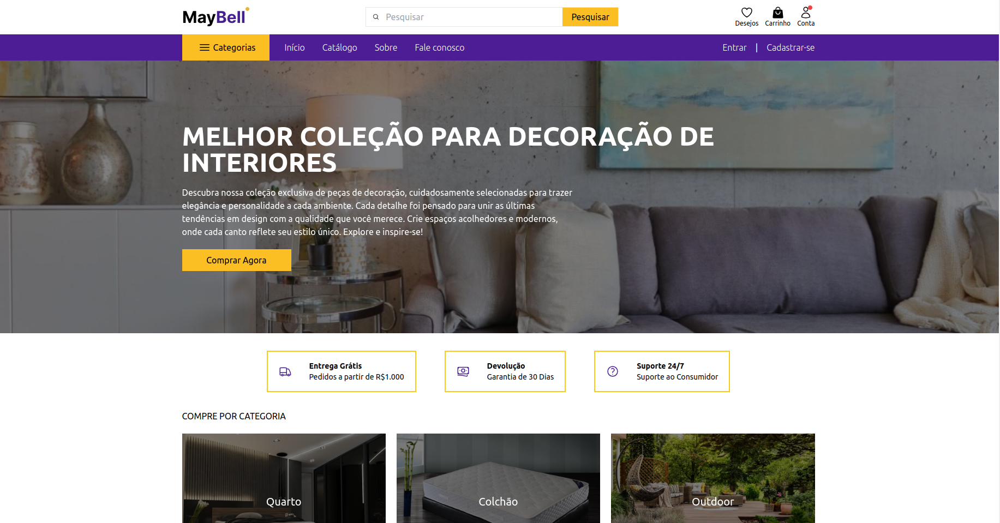
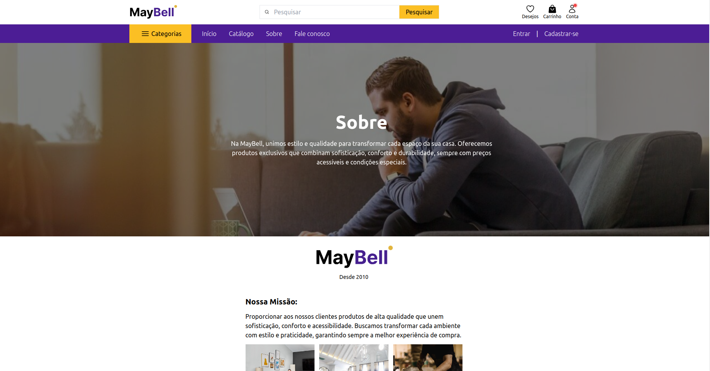
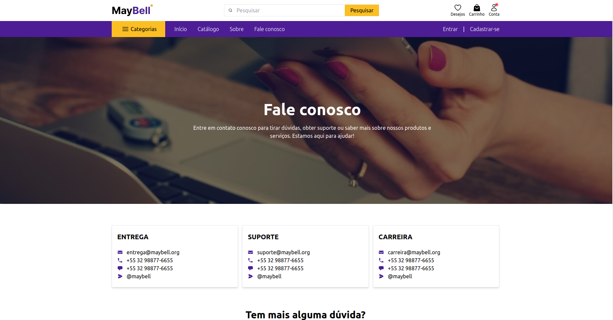
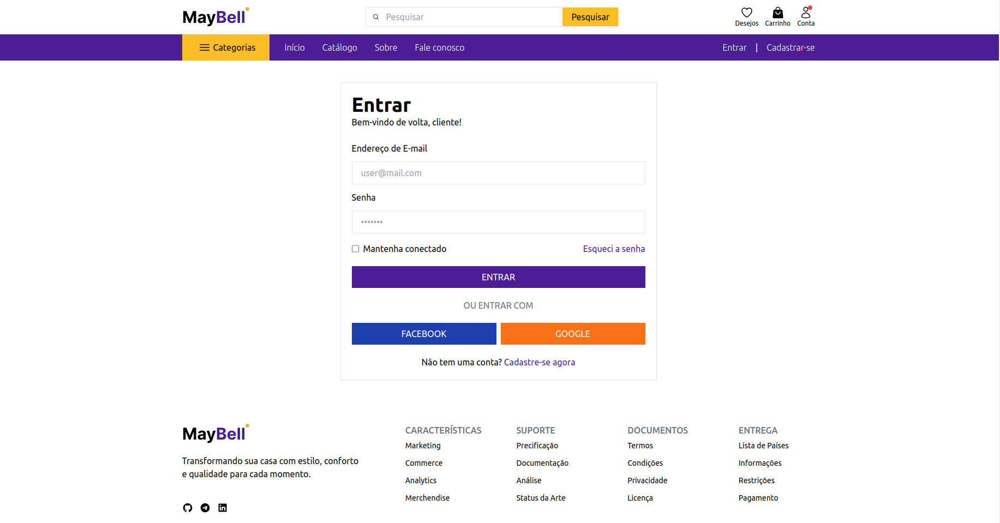
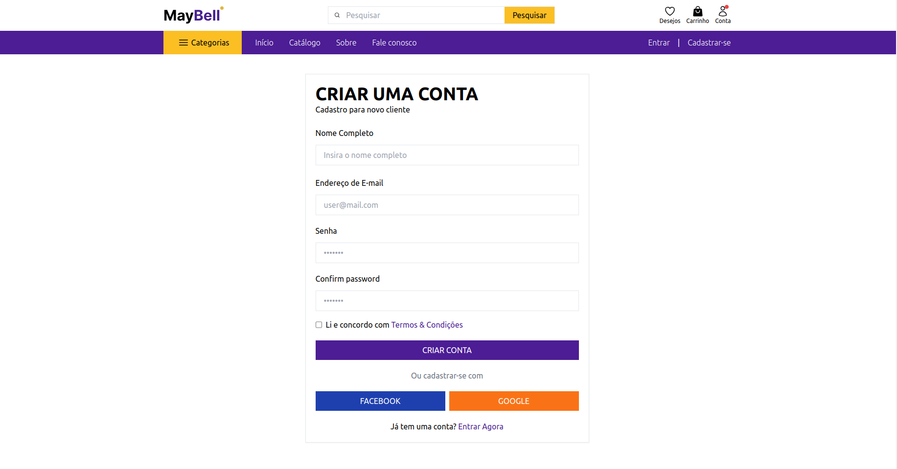

# Custom E-commerce Template

A custom e-commerce page template built with Tailwind CSS. Free for personal and commercial use.

> **Homepage**: [https://github.com/lucaskrispim/Trabalho_IHC](https://github.com/lucaskrispim/Trabalho_IHC)

---

## Overview

This template provides a modern, responsive e-commerce layout using:
- **Tailwind CSS** for rapid styling
- **Parcel** for bundling and easy development
- **Alpine.js** for lightweight interactivity
- **Splide** for sliders/carousels
- Additional configuration for icons, web manifest, and more

Feel free to adapt or expand the layout to suit your own brand or product line. Licensed under the [MIT License](#license).

---

## Getting Started

### Prerequisites

- [Node.js](https://nodejs.org/) (version 12 or above recommended)
- npm or yarn (whichever you prefer)

### Installation

1. **Clone** this repository or download the ZIP.
2. **Install** dependencies:
   ```bash
   npm install

# 1) Introduction: Application & User Interaction

This project is an e-commerce-style website focused on interior decoration items. The user can explore featured products on the Home page (index.html), learn more About Us (about-us.html), get in touch via Contact Us (contact-us.html), or manage their account through Login (login.html) and Sign Up (sign-up.html).

## How Users Navigate
- **index.html (Home)** -> links to **about-us.html** (About), **contact-us.html** (Contact Us), **login.html** (Login), **sign-up.html** (Register)
- **contact-us.html (Contact Us)** -> links to **index.html** (Home), **login.html** (Login), **sign-up.html** (Register), **about-us.html** (About)
- **login.html (Login)** -> links to **index.html** (Home), **contact-us.html** (Contact Us), **sign-up.html** (Register), **about-us.html** (About)
- **sign-up.html (Register)** -> links to **login.html** (Login), **index.html** (Home), **about-us.html** (About), **contact-us.html** (Contact Us)
- **about-us.html (About)** -> links to **login.html** (Login), **index.html** (Home), **contact-us.html** (Contact Us), **sign-up.html** (Register)

Each page shares a consistent header and footer, ensuring users can easily switch between sections without getting lost.

# 2) Design Decisions & IHC References

Below, each design choice is connected to one of the following references:
- **(IHC-01)** Nielsen’s Usability Heuristics
- **(IHC-02)** Cognitive Engineering / Cognitive Frameworks
- **(IHC-04)** Accessibility & Communicability ([WCAG 2.0](https://www.w3.org/Translations/WCAG20-pt-br/))
- **(IHC-05)** Colors

## 2.1 Nielsen’s Heuristics (IHC-01)
- **Visibility of System Status**: The main navigation bar and footer remain visible on every page (Heuristic 1).
- **Match Between System and Real World**: Familiar labels like “Entrar” (Login), “Registrar” (Sign Up) align with user expectations (Heuristic 2).
- **Consistency and Standards**: All pages use the same color scheme (violet/yellow), typography, and button styles (Heuristic 4).
- **Error Prevention**: Sign-up and login forms provide basic validation to reduce user mistakes (Heuristic 5).

## 2.2 Cognitive Engineering / Frameworks (IHC-02)
- **Reduced Cognitive Load**: The menu is concise, grouping essential links (Home, About, Contact, etc.) so users don’t have to remember hidden paths.
- **Mental Models**: Standard e-commerce icons (user icon, cart, envelope) and form fields follow common user expectations for online stores.
- **Progressive Disclosure**: The homepage highlights featured items; deeper details (e.g., sign-up, contact forms) appear when needed.

## 2.3 Accessibility & Communicability (IHC-04 / WCAG)
- **Contrast & Legibility**: The purple header and yellow buttons create sufficient contrast for text (WCAG 1.4.3).
- **Semantic Structure**: Pages use semantic tags (`<header>`, `<main>`, `<footer>`) and `<alt>` attributes for images, aiding screen readers (WCAG 1.1.1).
- **Keyboard Navigation**: Buttons and links are reachable via tab, ensuring accessibility for users with limited mobility (WCAG 2.1.1).

## 2.4 Colors (IHC-05)
- **Color Palette**: Violet for the header and main highlights, yellow for call-to-action buttons (contrasting background).
- **Meaningful Use**: Important actions (like “Search,” “Entrar,” “Registrar”) use the attention-grabbing yellow. Neutral backgrounds maintain clarity.

### The pages:

1. **Index**


2. **About**


3. **Contact us**


4. **Login**


5. **Sign up**
